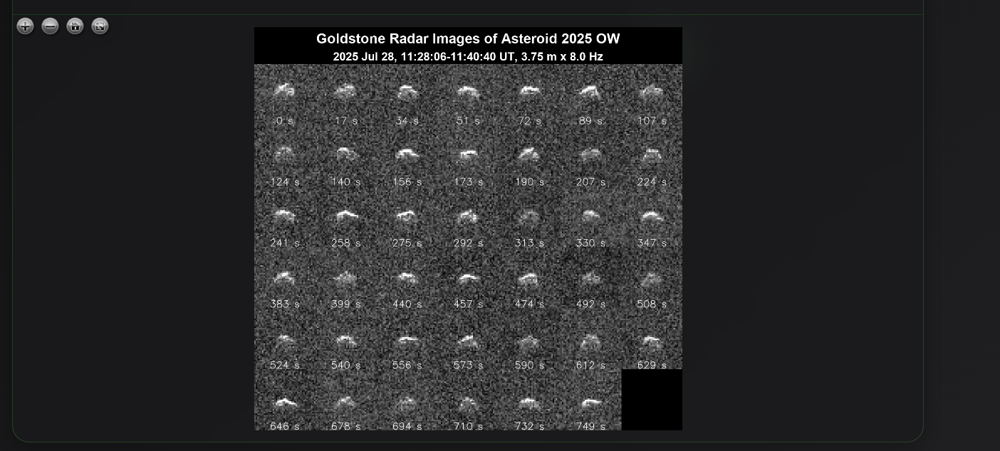

#  TIFF Viewer Pro


A **professional, high-performance TIFF image viewer** built with cutting-edge web technologies. Designed specifically for **medical imaging, scientific analysis, satellite images , space images and professional visualization** with advanced support for multiple TIFF formats and bit depths.


<p align="center">
  
</p>

<br>
<br>
<br>
<br>

-----

<p align="center">
  
</p>

<p align="center">
  
</p>

<p align="center">
  
</p>


<p align="center">
  
</p>


## ✨ Key Features

### 🩺 **Medical & Scientific Imaging Support**

- **1-bit Bitonal**: Black and white medical scans
- **8-bit Grayscale**: Standard medical and scientific images
- **16-bit High-Precision**: Radiography, X-rays, and medical imaging with histogram stretching
- **24-bit True Color**: Professional RGB imaging (8 bits per channel)
- **32-bit Float**: Scientific analysis 
- **48-bit High-Precision Color**: Advanced RGB imaging (16 bits per channel)

### 🚀 **Advanced Visualization**

- **Smooth Zoom & Pan**: Powered by OpenSeadragon technology
- **High-Resolution Support**: Handle large scientific and medical images
- **Real-time Processing**: Optimized histogram stretching for maximum contrast
- **Progressive Loading**: Smart loading with progress tracking
- **Responsive Design**: Perfect on desktop, tablet, and mobile


### 💾 **File Support**

- **Drag & Drop**: Intuitive file loading
- **Multiple Formats**: .tif, .tiff files
- **Large Files**: Optimized for high-resolution images
- **Real-time Validation**: TIFF format verification


## 🚀 Quick Start

### Prerequisites

- Node.js 18.0 or higher
- npm or yarn package manager

### Installation

```bash
# Clone the repository
git clone <repository-url>
cd <repository-url>

# Install dependencies
npm install

# Start development server
npm run dev
```

Open [http://localhost:3000](http://localhost:3000) in your browser.

### Building for Production

```bash
# Build the application
npm run build

# Start production server
npm run start
```

## 📋 Available Scripts

- `npm run dev` - Start development server
- `npm run build` - Build for production
- `npm run start` - Start production server
- `npm run lint` - Run ESLint code analysis

## 🔬 Use Cases

### Medical Imaging

- **Radiography**: X-ray image analysis with 16-bit precision
- **Medical Scans**: CT, MRI, and other medical imaging formats
- **Pathology**: High-resolution tissue sample analysis
- **Telemedicine**: Remote medical image consultation

### Scientific Research

- **Satellite Imagery**: NASA and space agency TIFF images
- **Microscopy**: High-precision scientific imaging
- **Geographic Information Systems (GIS)**: Geospatial data visualization
- **Astronomy**: Deep space imaging and analysis

### Professional Applications

- **Digital Archaeology**: Historical document and artifact imaging
- **Quality Control**: Industrial image analysis
- **Photography**: Professional high-bit depth image review
- **Architecture**: Blueprint and technical drawing visualization

## 📖 How to Use

1. **Load Images**:

   - Click "Choose File" to select a TIFF file
   - Or drag and drop TIFF files directly onto the interface

2. **Navigate Images**:

   - **Mouse wheel**: Zoom in/out
   - **Left click + drag**: Pan around the image
   - **Double click**: Quick zoom in
   - **Shift + click**: Zoom out

3. **Supported Formats**:
   - All standard TIFF variants (.tif, .tiff)
   - 1-bit to 32-bit depth support
   - Grayscale and color images
   - Scientific and medical imaging formats


## 🔧 Technical Details

### Image Processing Pipeline

1. **File Validation**: TIFF format verification
2. **Metadata Extraction**: Image dimensions, bit depth, color space
3. **Data Processing**: Histogram stretching for optimal contrast
4. **Normalization**: 16-bit/32-bit to 8-bit display conversion
5. **Canvas Rendering**: High-performance image display

### Performance Optimizations

- **Progressive Loading**: Chunked file reading with progress tracking
- **Memory Management**: Efficient handling of large images
- **Caching**: Smart tile caching for smooth navigation
- **Lazy Loading**: Components loaded only when needed

## 📚 Resources

### Libraries & Documentation

- **OpenSeadragon**: [https://openseadragon.github.io/](https://openseadragon.github.io/)
- **GeoTIFF.js**: [https://geotiffjs.github.io/](https://geotiffjs.github.io/)
- **Next.js**: [https://nextjs.org/docs](https://nextjs.org/docs)

### Sample Images

- **NASA Image Gallery**: [https://photojournal.jpl.nasa.gov/gallery/universe](https://photojournal.jpl.nasa.gov/gallery/universe)
- **Medical Imaging Samples**: Various radiography and medical scan formats
- **Scientific Data**: High-precision research imaging

## 🤝 Contributing

Contributions are welcome! Please feel free to submit issues and pull requests.

### Development Guidelines

- Follow TypeScript strict mode
- Use English for all interface text and comments
- Maintain the CryptoPoint design system
- Test with various TIFF formats and bit depths

## 📄 License

This project is licensed under the MIT License.

## 👨‍💻 Developer

**Diego Ivan Perea Montealegre**

- GitHub: [@diegoperea20](https://github.com/diegoperea20)

----

Created by [Diego Ivan Perea Montealegre](https://github.com/diegoperea20)
